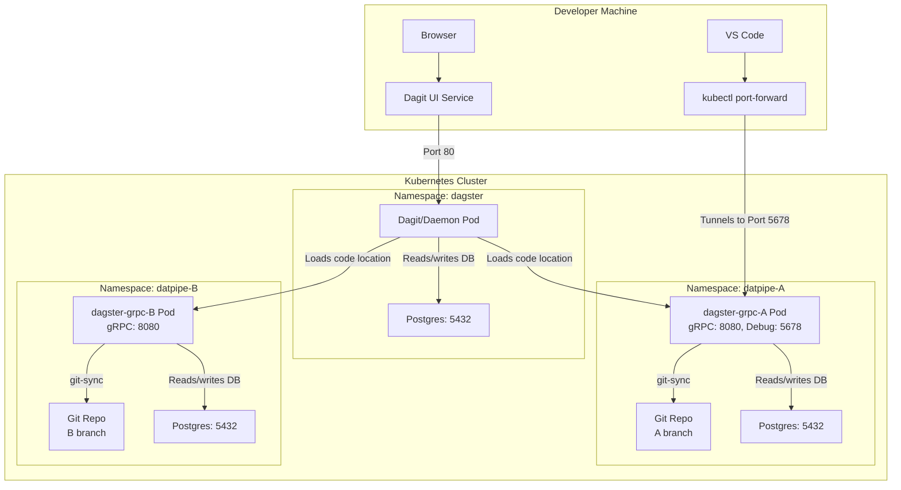

# Dagster GitOps Deployment

This directory contains the Kubernetes manifests for deploying a multi-environment Dagster setup using a GitOps workflow. It defines two isolated environments: Site A (`A`) and Site B (`B`).

The architecture is designed to support a robust development lifecycle, including code promotion via Git branches, isolated playgrounds for experimentation, and remote debugging capabilities.

## Architecture Overview

- **Environments**: The setup consists of two identical, isolated environments: `A` and `B`. Each lives in its own Kubernetes Namespace (`datpipe-A`, `datpipe-B`).
- **Central Dagster Instance**: A single Dagster instance (Dagit UI, Daemon) runs and connects to both the `A` and `B` environments, allowing you to view and manage both from one UI.
- **User Code Deployments**: User code is managed in separate gRPC servers for each environment (`dagster-grpc-A`, `dagster-grpc-B`).
- **GitOps with `git-sync`**: Each user code server uses a `git-sync` sidecar to automatically pull code from a specific branch of your Git repository.
  - The `A` environment syncs from the `A` branch.
  - The `B` environment syncs from the `B` branch.
- **Playground**: Each environment includes a `playground` code location. This is a writable directory inside the pod where developers can copy code using `kubectl cp` for live testing and exploration without committing to Git.
- **Remote Debugging**: The `A` environment is configured with a Python debugger (`debugpy`). This allows developers to attach VS Code for live, in-cluster debugging.

## Deployment Architecture



---

## Your Git Repository Structure

This setup expects your Dagster code repository to be structured with a `workspace.yaml` at its root.

```
/your-dagster-repo
├── .git/
├── my_dagster_project/
│   ├── __init__.py
│   └── definitions.py
└── workspace.yaml
```

The `workspace.yaml` file should define two code locations: one for your main project and one for the playground.

**`workspace.yaml` content:**

```yaml
load_from:
  # 1. The main location, synced from this git repo
  - python_module:
      module_name: my_dagster_project.definitions
      location_name: "git_synced_code"

  # 2. The playground location, for ad-hoc testing
  - python_package:
      package_name: playground
      location_name: "playground"
```

---

## Initial Deployment

1.  **Create Namespaces and Databases**:
    This command creates the `datpipe-A` and `datpipe-B` namespaces and a dedicated PostgreSQL database for each.

    ```bash
    kubectl apply -f k8s_deploy/postgres/
    ```

2.  **Deploy the Central Dagster Instance**:
    This deploys the Dagit UI and Dagster Daemon. It's configured to load the `A` and `B` gRPC servers as code locations.

    ```bash
    kubectl apply -f k8s_deploy/instance/
    ```

3.  **Deploy the `A` Environment**:
    This deploys the gRPC server for the `A` environment, with `git-sync` configured to track the `A` branch.

    ```bash
    kubectl apply -f k8s_deploy/A/
    ```

4.  **Deploy the `B` Environment**:
    This deploys the gRPC server for the `B` environment, with `git-sync` configured to track the `B` branch.

    ```bash
    kubectl apply -f k8s_deploy/B/
    ```

---

## Development Workflows

### A. Git-Based Promotion (`A` -> `B`)

1.  **Develop**: Make changes to your Dagster code on a feature branch.
2.  **Push to `A`**: When ready for testing, merge your feature branch into the `A` branch and push.
    ```bash
    git checkout A
    git merge my-feature-branch
    git push origin A
    ```
3.  **Verify**: The `git-sync` sidecar in the `A` environment will automatically pull the changes. Open Dagit, go to the `A_environment` code location, and reload it to see your updated code.
4.  **Promote to `B`**: Once verified, merge the `A` branch into the `B` branch.
    ```bash
    git checkout B
    git merge A
    git push origin B
    ```
5.  The `B` environment will now be updated with the new code.

### B. Playground for Live Experimentation

1.  **Find Your Pod**: Get the name of the pod for the environment you want to test in (e.g., `A`).

    ```bash
    kubectl get pods -n datpipe-A -l app=dagster-grpc-A
    ```

2.  **Copy Your Code**: Use `kubectl cp` to copy your local script into the pod's playground directory.

    ```bash
    # Example:
    kubectl cp ./my_test.py <A-pod-name>:/opt/dagster/app/playground/ -n datpipe-A
    ```

3.  **Reload in Dagit**: Navigate to the `playground` code location within the `A_environment` in the Dagit UI and click "Reload". Your new assets/jobs will appear.

### C. Remote Debugging in the `A` Environment

1.  **Find the `A` Pod Name**:

    ```bash
    kubectl get pods -n datpipe-A -l app=dagster-grpc-A
    ```

2.  **Forward the Debug Port**: Use `kubectl port-forward` to create a secure tunnel from your local machine to the debug port (`5678`) on the pod.

    ```bash
    kubectl port-forward <A-pod-name> 5678:5678 -n datpipe-A
    ```

3.  **Configure VS Code**: Create or update the `.vscode/launch.json` file in your local project with the following configuration:

    ```json
    {
      "version": "0.2.0",
      "configurations": [
        {
          "name": "Attach to Dagster (k8s-A)",
          "type": "python",
          "request": "attach",
          "connect": {
            "host": "localhost",
            "port": 5678
          },
          "pathMappings": [
            {
              "localRoot": "${workspaceFolder}",
              "remoteRoot": "/opt/dagster/app"
            }
          ]
        }
      ]
    }
    ```

4.  **Start Debugging**: Set breakpoints in your local code, run the "Attach to Dagster (k8s-A)" configuration from the "Run and Debug" panel in VS Code. When you execute a run in Dagit that uses your code, the debugger will pause at your breakpoints.

## Additional Resources

- [Deploying a Docker image to AWS Lambda](https://docs.astral.sh/uv/guides/integration/aws-lambda/#deploying-a-docker-image)
- [uv integration with AWS Lambda](https://docs.astral.sh/uv/guides/integration/aws-lambda/)
